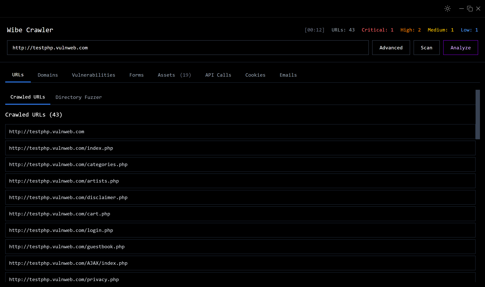
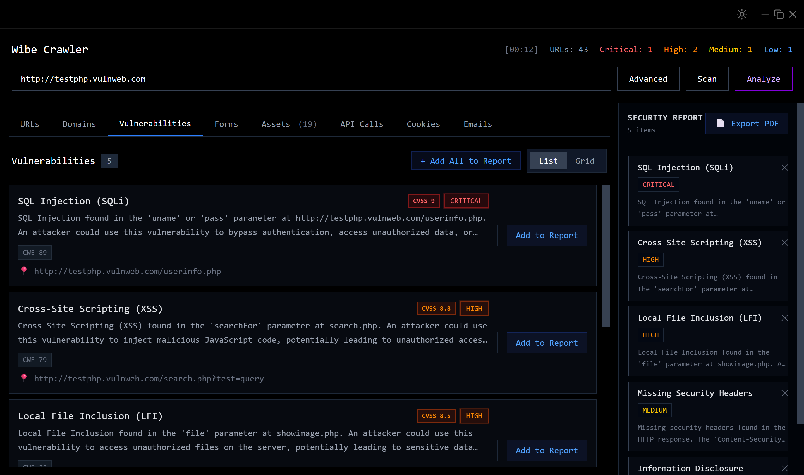
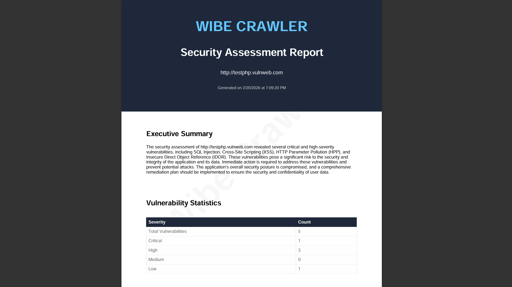
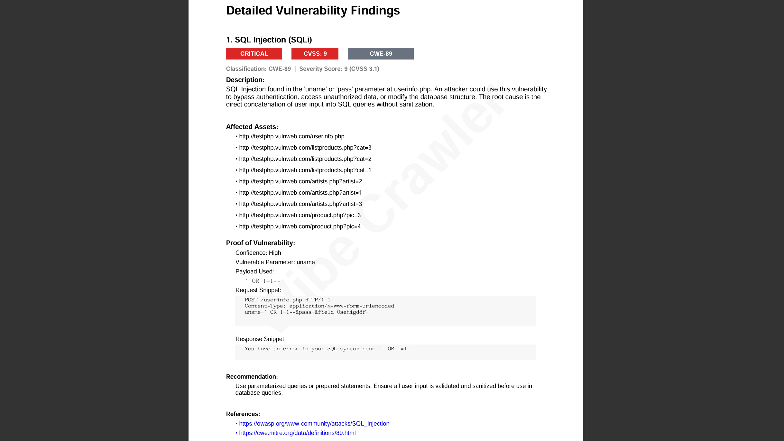
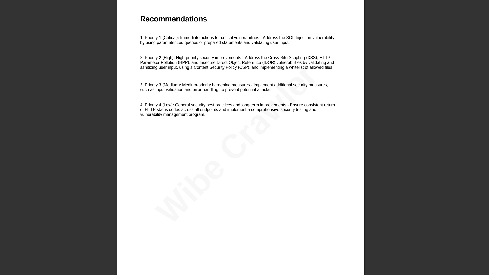

# Wibe Crawler & MR-Robot

An AI-powered web security assessment suite that combines a high-performance Electron-based crawler with an intelligent backend penetration testing agent (`mr-robot`).

## Architecture Overview

This project is structured as a monorepo containing two main components:

1.  **Frontend (Wibe Crawler)**: Built with Electron, Svelte 5, and TypeScript. It handles high-speed web crawling, directory fuzzing, and AI-driven vulnerability synthesis.
2.  **Backend (MR-Robot)**: A Python-based FastAPI service running in Docker. It controls a suite of professional security tools to perform deep-dive analysis on discovered assets.

---

## Key Features

### Vulnerability Analysis
- **AI-Powered Discovery**: Uses Large Language Models (LLMs) via the Groq API to analyze crawled data for complex security flaws.
- **Automated Reporting**: Generates comprehensive PDF security reports with CVSS scores, CWE mappings, and remediation steps.
- **Live Event Stream**: Real-time feedback during analysis, showing exactly what the backend "is thinking" and which tools it's using.

### Advanced Crawling
- **Native Web Crawler**: High-performance crawling with support for forms, API calls, cookies, and asset extraction.
- **Directory Fuzzing**: Built-in fuzzer for discovering hidden directories and files using customizable wordlists.
- **Interactive UI**: Real-time visualization of discovered URLs, domains, and security insights.

### Professional Backend Tools (via MR-Robot)
The integrated backend provides access to:
- **Nmap**: Network discovery and security auditing.
- **Sqlmap**: Automated SQL injection and database takeover.
- **Nikto**: Web server security scanning.
- **XSStrike**: Advanced XSS detection and exploitation.
- **WPScan**: WordPress security scanning.
- **Gobuster**: URI and DNS brute-forcing.

---


## 📸 Screenshots

<div align="center">
  
  
  
  
  
</div>


## Project Setup

### Prerequisites
- [Node.js](https://nodejs.org/) (v18 or higher)
- [Docker Desktop](https://www.docker.com/products/docker-desktop/)
- [Groq API Key](https://console.groq.com/) (Must be set in `.env` as `GROQ_API_KEY`)

### Quick Start

1.  **Install Dependencies**:
    ```bash
    npm install
    ```

2.  **Start Backend Services**:
    ```bash
    npm run backend:up
    ```

3.  **Run Development App**:
    ```bash
    npm run dev  # or 'bun run dev' if preferred
    ```

### Command Reference

| Command | Action |
| :--- | :--- |
| `npm run dev` | Start the Electron app in development mode |
| `npm run backend:up` | Start the `mr-robot` backend containers |
| `npm run backend:down` | Shut down the backend containers |
| `npm run backend:logs` | View real-time logs from the backend agent |
| `npm run build:win` | Build the standalone executable for Windows |

---

## Troubleshooting

- **Backend Connection Failure**: Ensure Docker is running and the `mr-robot-agent` container is healthy. The app defaults to `http://localhost:8000`.
- **API Quota Errors**: Ensure your `GROQ_API_KEY` is valid and has sufficient quota.
- **Build Failures**: If `mr-robot` fails to build, try `npm run backend:logs` to identify missing dependencies or network issues during the Docker build process.

## Recommended IDE Setup
- [VSCode](https://code.visualstudio.com/) + [ESLint](https://marketplace.visualstudio.com/items?itemName=dbaeumer.vscode-eslint) + [Prettier](https://marketplace.visualstudio.com/items?itemName=esbenp.prettier-vscode) + [Svelte](https://marketplace.visualstudio.com/items?itemName=svelte.svelte-vscode)
